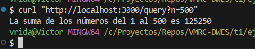
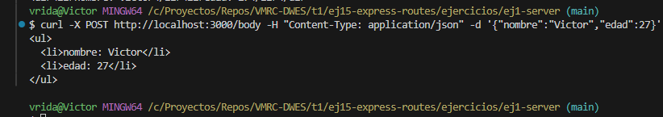
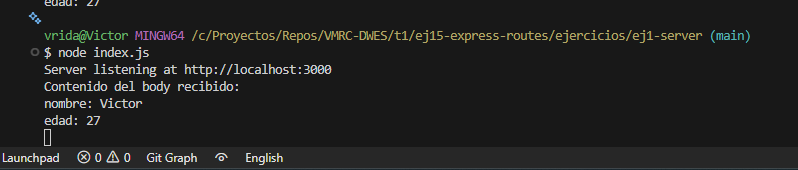
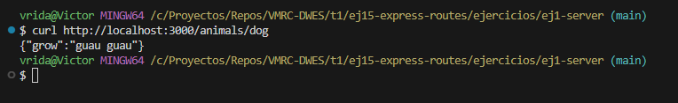
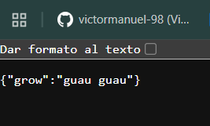
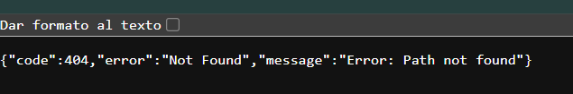
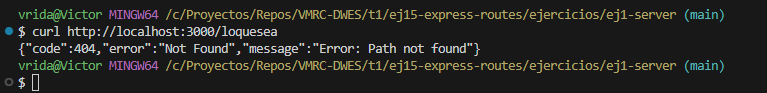

# Ejercicio: Servidor Express con Rutas

Realizar un solo servidor en el que programar todos los ejercicios, separados por sus rutas:

## 1. '/header' recoger he imprimir por consola un parámetro llamado 'token'.
Si no está definido, devolver la respuesta con el código 401 y un objeto.

```
{
 "code": 401,
 "error": "Unauthorized",
 "message": "Error: Set a token to login"
}
```

### Resultado  


---

## 2. /params crear un parámetro llamado name en la ruta y devolver Hola ${name}

### Resultado  


---

## 3. /query enviar un número n y devolver la suma de todos los números desde el 1 hasta el número recibido.

Si el número no se define, se tomará 100 por defecto.

### Resultado  


---

## 4. /body Imprimir todo el objeto entrante en una lista HTML en el que se muestren todos los parámetros: su clave y su valor.

Recibe un objeto JSON mediante POST y devuelve como respuesta una lista `<ul>` con sus claves y valores.  
Además, imprime el body por consola.

### Resultado  




---

## 5. '/animals' Crear un enrutador bajo dicha ruta establecer los siguientes endpoint:

Incluye las rutas:

- `/animals/dog` → `{ "grow": "guau guau" }`
- `/animals/cat` → `{ "grow": "miau" }`
- `/animals/bird` → `{ "grow": "pio pio" }`

### Resultado  




---

## 6. El resto de rutas, han de devolver el código 404 con un objeto en la respuesta:

```
{
  "code": 404,
  "error": "Not Found",
  "message": "Error: Path not found"
}
```

### Resultado






