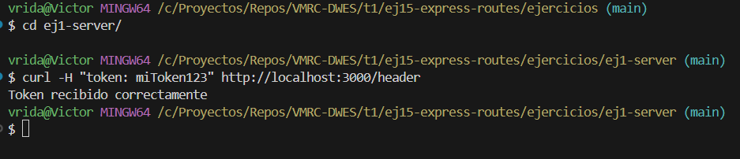
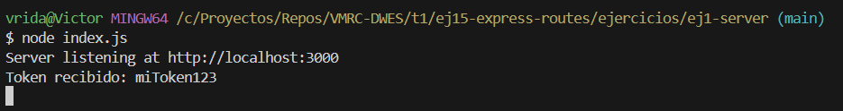
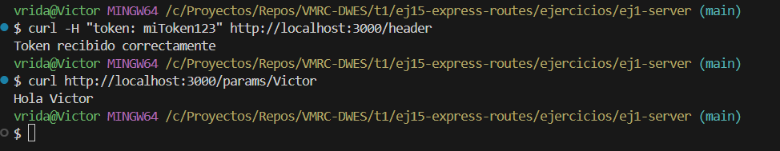

# Ejercicio: Servidor Express con Rutas

Realizar un solo servidor en el que programar todos los ejercicios, separados por sus rutas:

## 1. '/header' recoger he imprimir por consola un parámetro llamado 'token'.
Si no está definido, devolver la respuesta con el código 401 y un objeto.

```
{
 "code": 401,
 "error": "Unauthorized",
 "message": "Error: Set a token to login"
}
```

### Resultado  



---



---

## 2. /params crear un parámetro llamado name en la ruta y devolver Hola ${name}

Devuelve un saludo usando el parámetro de la ruta.

Ejemplo:  
`/params/Victor → "Hola Victor"`

### 🔍 Resultado  


---

## 📌 3. Ruta **/query**

Recibe un número *n* por query string y devuelve la suma del 1 al *n*.  
Si no se envía, n = **100** por defecto.

Ejemplo:  
`/query?n=50`

### 🔍 Resultado  


---

## 📌 4. Ruta **/body**

Recibe un objeto JSON mediante POST y devuelve como respuesta una lista `<ul>` con sus claves y valores.  
Además, imprime el body por consola.

### 🔍 Resultado  


---

## 📌 5. Router **/animals**

Incluye las rutas:

- `/animals/dog` → `{ "grow": "guau guau" }`
- `/animals/cat` → `{ "grow": "miau" }`
- `/animals/bird` → `{ "grow": "pio pio" }`

### 🔍 Resultado  


---

## 📌 6. Rutas no definidas (404)

Cualquier ruta no contemplada devolverá:

```json
{
  "code": 404,
  "error": "Not Found",
  "message": "Error: Path not found"
}


