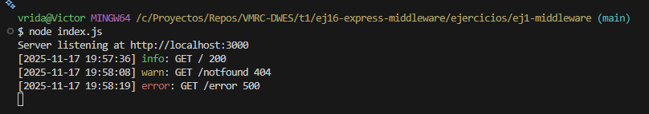

### Se debe:

## 1. Realizar un logger que imprima a distinto nivel y formato las peticiones con respuesta

```
– 2XX –> info
– 4XX –> warn
– 5XX –> error
```
---

### Resultado



---


---


---

## 2. Realizar un middleware que valide el acceso a una zona restringida para usuarios admin.
Para ello, en la petición se enviará en la cabecera el parámetro password con el valor #patata#. En
caso contrario, o si no define se define el parámetro, no permitirá el acceso.

– Acceso correcto: Se enviará como respuesta el mensaje 
'Bienvenid@, disfrute del contenido, con el código 200 OK.'

– Acceso incorrecto: Se enviará un objeto de error con el código 401 unauthorized y el men-
saje Acceso restringido, por favor, incluya la palabra secreta en el

parámetro 'password'en la cabera de la petición
