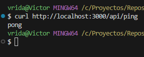
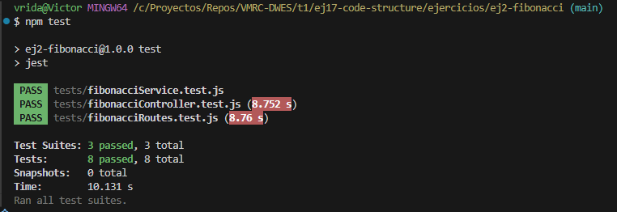

### Se debe:
---
## 1. Crear una estructura base de ejemplo, que sea ejecutable y permita responder a la ruta /ping, con el mensaje ‘pong’.

### Estructura de carpetas
```
src
 ┣ loaders
 ┃ ┗ express.js
 ┣ routes
 ┃ ┗ ping.js
 ┣ app.js
 ┗ index.js
```

### Resultados
---

---

---

## 2. Crear un proyecto bien estructurado con la ruta /fibonacci realizando la correcta separación
del código.
- 'controllers' Contiene las llamadas a los distintos servicios si los requiere
- 'routes' Contiene la definición de rutas y selección del controlador que emite la respuesta
- 'loaders' Contiene el despliegue y configuracion del servidor
- 'utils' (opcional) Contiene elementos de utilidad, como el logger.
- Realizar los test unitarios a todos los ficheros creados (a excepción de los index.js)

### Estructura de carpetas
---


## Resultado
---


---

## 3. Trabajo "PROYECTO DE NOTAS"

- Implementar la estructura para el proyecto de notas aplicando la división del código en los distintos módulos.

# Nueva estructura del proyecto
```
trabajoextra
 ┣ controllers
 ┃ ┗ notasController.js
 ┣ data
 ┃ ┗ notas.json
 ┣ loaders
 ┃ ┗ loadServer.js
 ┣ models
 ┣ node_modules
 ┃ ┣ chalk
 ┃ ┃ ┣ source
 ┃ ┃ ┃ ┣ vendor
 ┃ ┃ ┃ ┃ ┣ ansi-styles
 ┃ ┃ ┃ ┃ ┃ ┣ index.d.ts
 ┃ ┃ ┃ ┃ ┃ ┗ index.js
 ┃ ┃ ┃ ┃ ┗ supports-color
 ┃ ┃ ┃ ┃ ┃ ┣ browser.d.ts
 ┃ ┃ ┃ ┃ ┃ ┣ browser.js
 ┃ ┃ ┃ ┃ ┃ ┣ index.d.ts
 ┃ ┃ ┃ ┃ ┃ ┗ index.js
 ┃ ┃ ┃ ┣ index.d.ts
 ┃ ┃ ┃ ┣ index.js
 ┃ ┃ ┃ ┗ utilities.js
 ┃ ┃ ┣ license
 ┃ ┃ ┣ package.json
 ┃ ┃ ┗ readme.md
 ┃ ┣ readline-sync
 ┃ ┃ ┣ lib
 ┃ ┃ ┃ ┣ encrypt.js
 ┃ ┃ ┃ ┣ read.cs.js
 ┃ ┃ ┃ ┣ read.ps1
 ┃ ┃ ┃ ┣ read.sh
 ┃ ┃ ┃ ┗ readline-sync.js
 ┃ ┃ ┣ LICENSE
 ┃ ┃ ┣ package.json
 ┃ ┃ ┣ README-Deprecated.md
 ┃ ┃ ┗ README.md
 ┃ ┗ .package-lock.json
 ┣ routes
 ┃ ┗ notasRoutes.js
 ┣ ui
 ┃ ┗ menu.js
 ┣ utils
 ┃ ┗ fileManager.js
 ┣ main.js
 ┣ package-lock.json
 ┗ package.json
```

