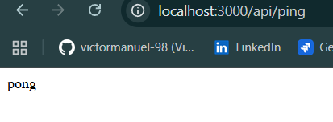

### Se debe:
---
## 1. Crear una estructura base de ejemplo, que sea ejecutable y permita responder a la ruta /ping, con el mensaje ‘pong’.

### Estructura de carpetas
```
src
 ┣ loaders
 ┃ ┗ express.js
 ┣ routes
 ┃ ┗ ping.js
 ┣ app.js
 ┗ index.js
```

### Resultados
---


---


---

## 2. Crear un proyecto bien estructurado con la ruta /fibonacci realizando la correcta separación
del código.
- 'controllers' Contiene las llamadas a los distintos servicios si los requiere
- 'routes' Contiene la definición de rutas y selección del controlador que emite la respuesta
- 'loaders' Contiene el despliegue y configuracion del servidor
- 'utils' (opcional) Contiene elementos de utilidad, como el logger.
- Realizar los test unitarios a todos los ficheros creados (a excepción de los index.js)

### Estructura de carpetas
