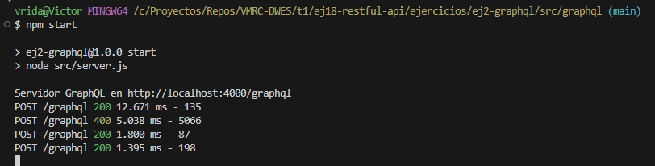
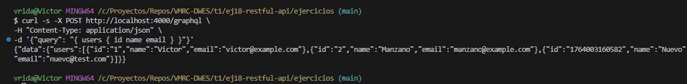

# Ejercicio 2 - API GraphQL

Este proyecto es la versión del **Trabajo de Investigación** implementada con **GraphQL**
---

## 🔧 Tecnologías utilizadas

- **Node.js** v24.x  
- **Apollo Server**  
- **GraphQL**  
- **Express**  

---

## Estructura del trabajo
```
src
 ┣ data
 ┃ ┗ users.data.js
 ┣ graphql
 ┃ ┗ schema.js
 ┗ server.js
```
## Imagenes con los resultados por terminal


---



