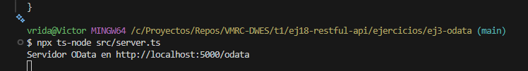
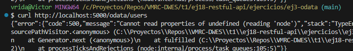

# Ejercicio 3 - OData API

Este proyecto implementa un servicio **OData v4** usando Node.js y TypeScript. La API expone un conjunto de recursos (`Users`) siguiendo el estándar OData, permitiendo consultas RESTful con soporte de filtrado, ordenación y paginación.

---

## Tecnologías utilizadas

- Node.js
- TypeScript
- Express
- odata-v4-server
- body-parser
- morgan
- helmet

---

## Estructura
```
src
 ┗ server.ts
```

## Imagenes con los resultados


---

### No conseguí que se mostrasen los usuarios


