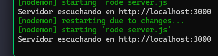
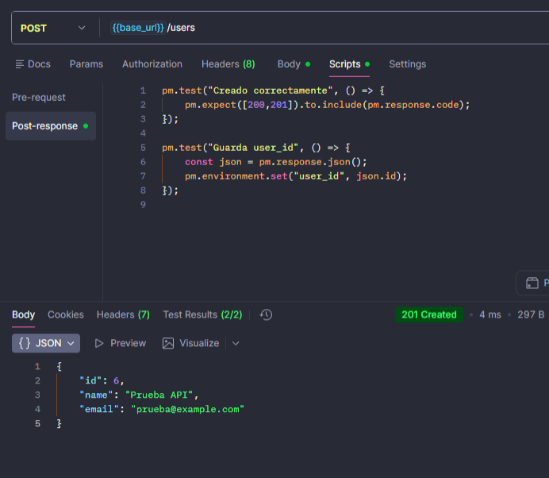
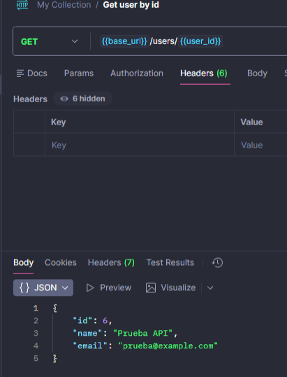
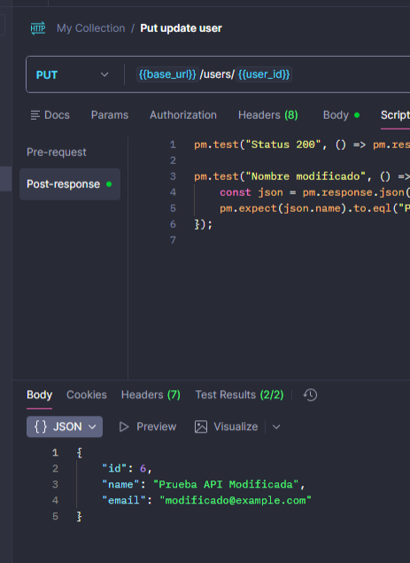
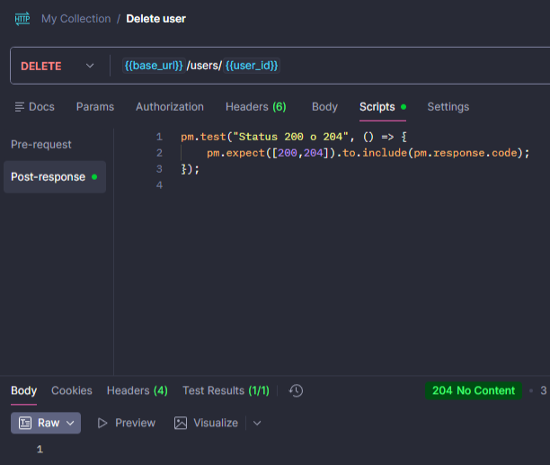
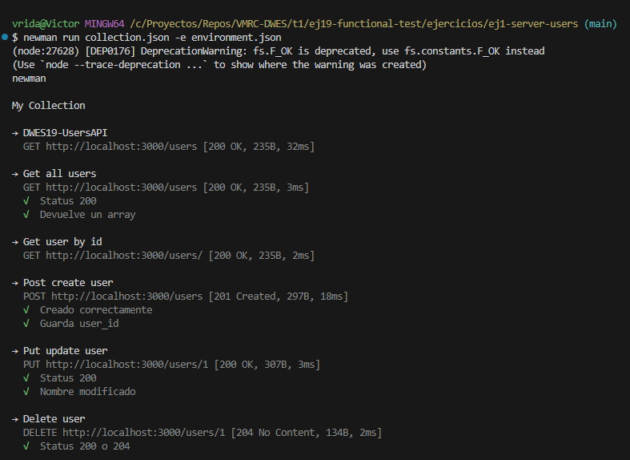

# DWES19 - Users API

Este proyecto consiste en un servidor Node.js que permite gestionar usuarios a través de una API REST. Se han implementado los métodos CRUD: crear, obtener, actualizar y eliminar usuarios.  
El proyecto incluye la configuración del servidor, pruebas con Postman y ejecución de tests automáticos con Newman.

---

## Configuración del proyecto

**Requisitos:**

- Node.js >= 14
- npm
- Postman (o alternativa: Insomnia, Firecamp)

**Instalación:**

```
git clone <repositorio>
cd <ruta_del_proyecto>
npm install
```

**Ejecutar el servidor:**

```
npm run dev
```


---

## API Endpoints

**1.Crear usuario (POST /users)**



---

**2. Listar todos los usuarios (GET /users)**


---

**3. Obtener usuario por ID (GET /users/:id)**



---

**4. Actualizar usuario (PUT /users/:id)**



---

**5. Eliminar usuario (DELETE /users/:id)**



---

## Pruebas automáticas con Newman

Se incluye la colección `collection.json` y el entorno `environment.json` para Postman.

Ejecutar tests automáticos:

```
newman run collection.json -e environment.json
```




