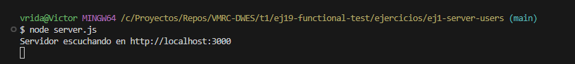
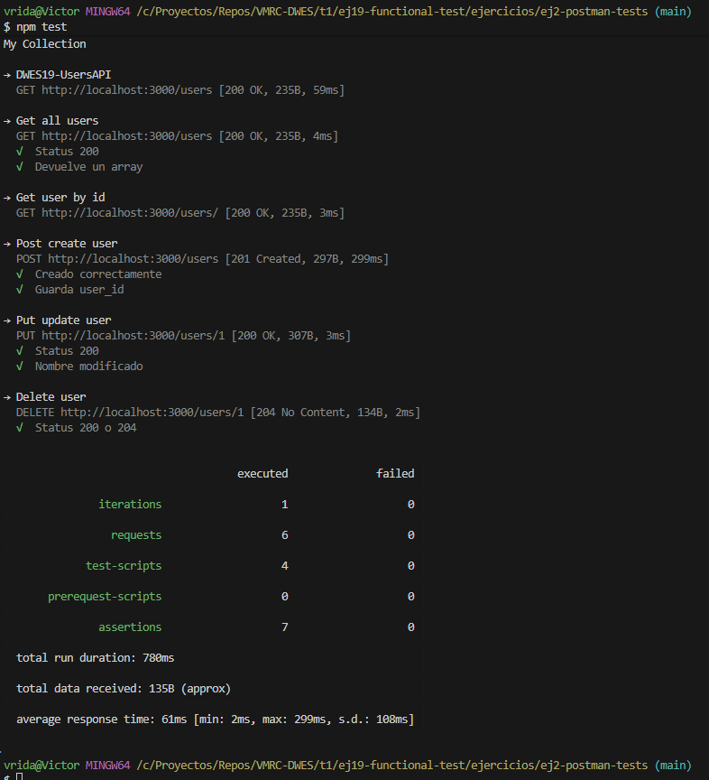

# Ejercicio 2 — Configurar Postman y Newman para ejecutar tests automáticamente

## Descripción del ejercicio
En este ejercicio se configura un entorno automatizado para ejecutar tests de una API usando **Postman** y **Newman**.  
El objetivo es que los tests definidos en Postman puedan ejecutarse desde la terminal con `npm test`, permitiendo integrarlos en CI/CD o automatizar pruebas locales.

---

## Estructura del proyecto

```
ej2-postman-tests/
│── collection.json
│── environment.json
│── package.json
└── node_modules/
````

---

## Instalación del proyecto

### 1. Instalar dependencias

```
npm install
````

### 2. Instalar Newman como dependencia de desarrollo

```bash
npm install newman --save-dev
```
---

## ▶️ Cómo ejecutar los tests

Asegúrate de que el servidor de la API está corriendo:

```bash
node server.js
```

Luego ejecuta:

```bash
npm test
```

### Ejecución del servidor:



### Ejecución de npm test con Newman:


