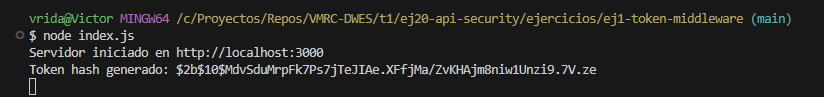
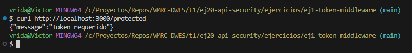
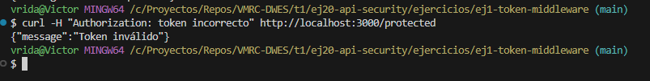
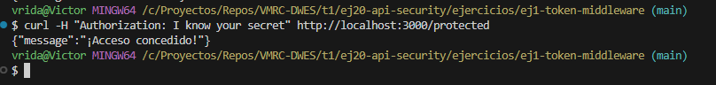

# Ejercicio 1 — Middleware con Token Encriptado (bcrypt)

## Descripción

Realizar un middleware que valide el acceso a través de un token válido (desencriptar el token con bcrypt)

- Se tomará por acceso válido si el mensaje original es 'I know your secret'.


El servidor genera un hash seguro de este mensaje al iniciarse, y luego compara cualquier token recibido con ese hash usando `bcrypt.compare()`.

---

## Estructura del proyecto

```
ej1-token-middleware/
├── node_modules
├── index.js
└── package.json
```
---

## Funcionamiento

### 1. Generación del token (hash)

Cuando el servidor se inicia, se genera un hash del mensaje `"I know your secret"` usando bcrypt.

Token generado


---

### 2. Acceso sin token

Si el cliente no envía ninguna cabecera `Authorization`, el servidor devuelve:

Token requerido


---

### Token incorrecto

Si el token no coincide con el mensaje original, el sistema devuelve:

Token inválido


---

### Token válido

Si el cliente envía `"I know your secret"` como token, el acceso es concedido.

Token correcto


---

## Pruebas con cURL

### Token válido

```
curl -H "Authorization: I know your secret" http://localhost:3000/protected
```

### Token inválido

```
curl -H "Authorization: invalid-token" http://localhost:3000/protected
```

### Sin token

```
curl http://localhost:3000/protected
```
