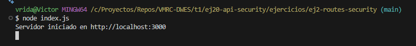
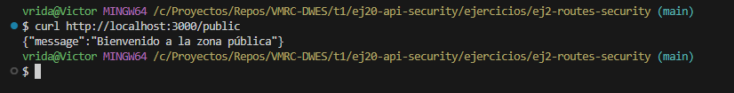
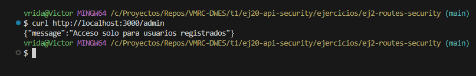
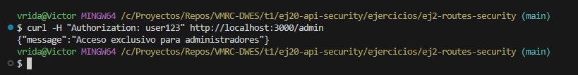
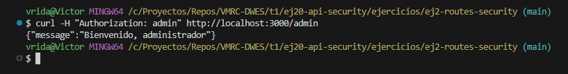
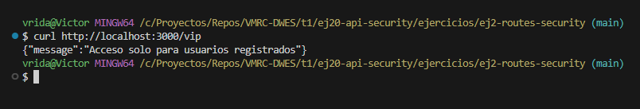
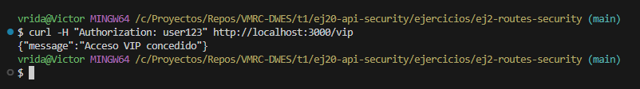

# Ejercicio 2: Crear un servidor que tenga las siguientes rutas:

- '/public' Acceso público que permitirá el acceso a invitados
- '/vip' Acceso que dará acceso a usuarios registrados
- '/admin' Acceso exclusivo a usuarios con rol admin

## Estructura del proyecto
```
ej2-routes-security/
├── index.js
├── package.json
└── package-lock.json
```

## Funcionamiento

### 1. Iniciar el servidor


### 2. Servidor público


### 3. Servidor administrador sin token


### 4. Servidor administrador con token


### 5. Servidor administrador con rol admin


### 6. Servidor VIP sin token


### 7. Servidor VIP con token

