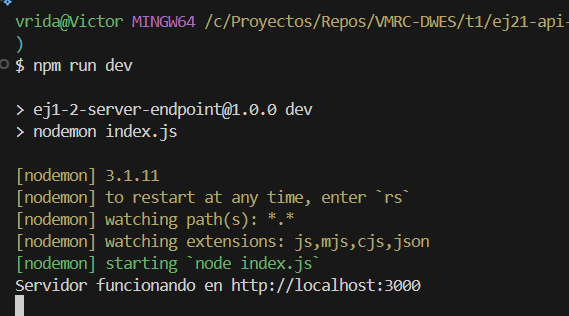
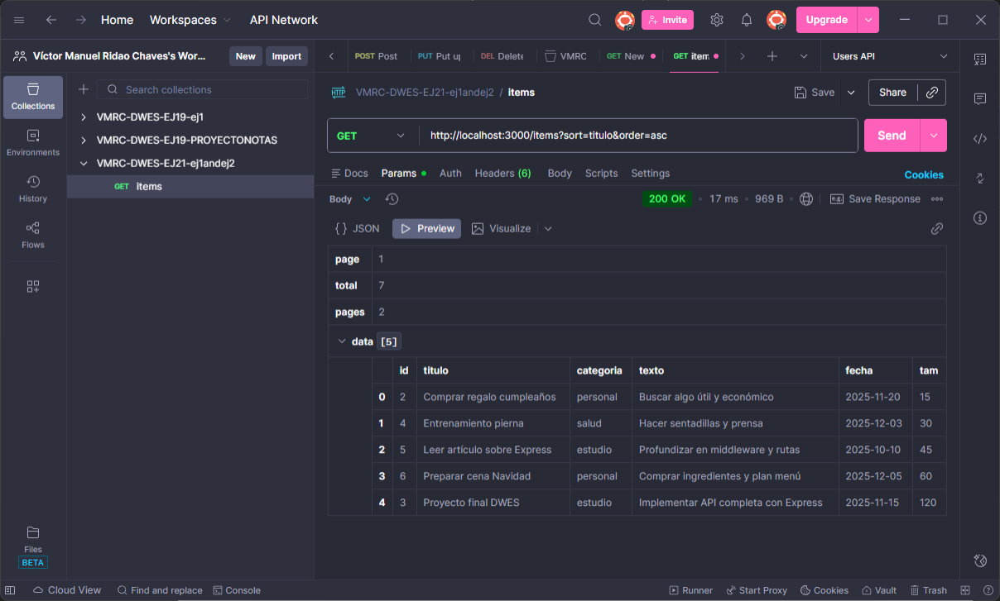
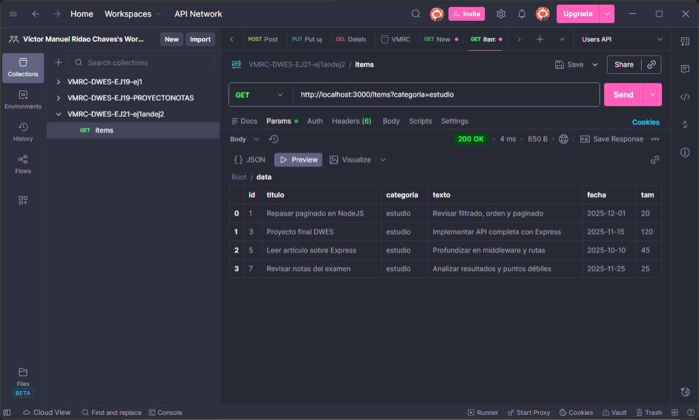
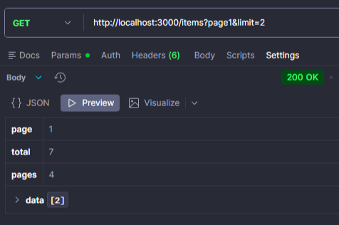

# Ejercicio 1+2: API con filtrado, ordenación y paginado

## Descripción
Este ejercicio implementa un servidor **NodeJS + Express** con un endpoint `/items` que devuelve una lista de elementos (notas, libros, usuarios, etc.).  
El endpoint soporta:

- **Filtrado**: por `titulo`, `texto`, `categoria`, rango de fechas (`desde` / `hasta`) y tamaño (`minTam` / `maxTam`).  
- **Ordenación**: ascendente o descendente por cualquier campo (`sort=campo` o `sort=-campo`).  
- **Paginación**: mediante `page` y `limit`.

---

## Instalación y ejecución

```
# Instalar dependencias
npm install

# Ejecutar el servidor en desarrollo
npm run dev
````

Servidor disponible en: `http://localhost:3000`

## Capturas

**Server funcionando:**


**Pruebas de Ordenación en Postman:**


**Pruebas de Filtrado en Postman:**


**Pruebas de Paginado en Postman:**

