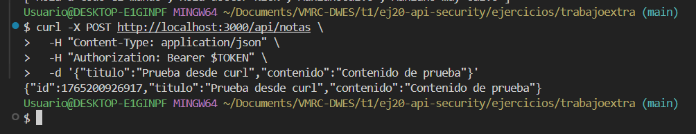

# Gestor de Notas (se añaden imágenes al final con los resultados)

Añadir seguridad al proyecto notas con un token encriptado y con el nombre de un usuario 'admin' dado por variable de entorno.

---

## Instalación

Se clona la carpeta con el trabajo desde el tema 19 y se añade a la carpeta del tema 20:

## Ejecución mediante capturas


### Conexión al puerto 3000


---

### Se da el TOKEN y se listan las notas


---

### Crear nota de prueba



---

### JSON con notas


---

## Ordenar, filtrar y paginar notas (API)

Endpoint protegido: `GET /api/notas` con `Authorization: Bearer <token>`.

Parámetros de consulta disponibles:

- `filterTitle` / `title`: filtra por texto incluido en el título.
- `filterContent` / `content`: filtra por texto incluido en el contenido.
- `category` / `group` / `grupo`: filtra por categoría o grupo exacto.
- `fromDate` / `from` y `toDate` / `to`: rango de fechas (creación o última edición). Acepta timestamp o fecha parseable.
- `sortBy`: `date` (creación), `updated`, `titulo`/`title`, `size`.
- `order`: `asc` (default) o `desc`.
- `page`: número de página (>=1).
- `perPage`: elementos por página (default 10 o `NOTAS_PER_PAGE_DEFAULT`).

Ejemplo: `/api/notas?filterTitle=nota&sortBy=updated&order=desc&page=1&perPage=5`

La respuesta con parámetros incluye:

```json
{
	"items": [ /* notas filtradas y paginadas */ ],
	"totalItems": 12,
	"totalPages": 3,
	"page": 1,
	"perPage": 5
}
```
