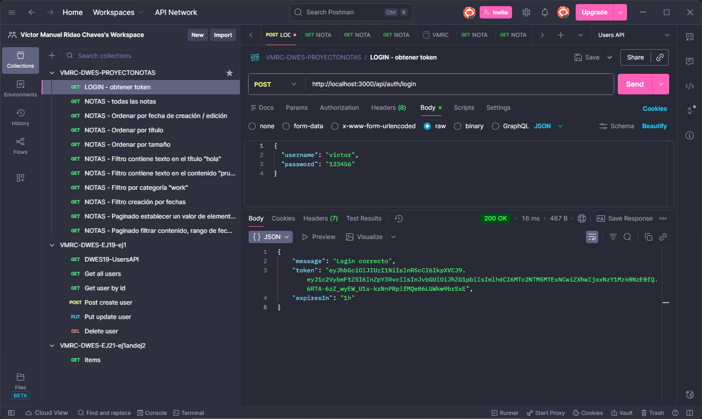
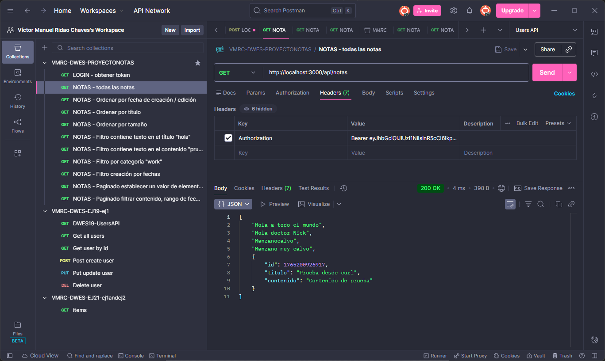
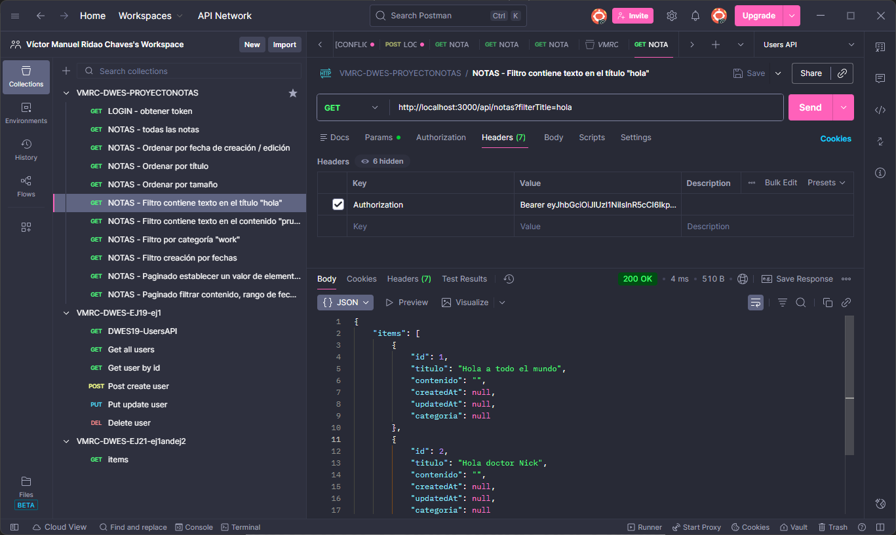
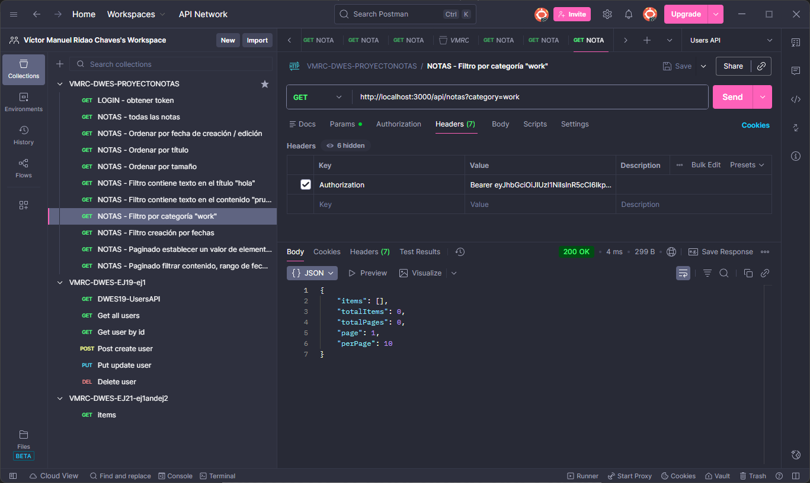
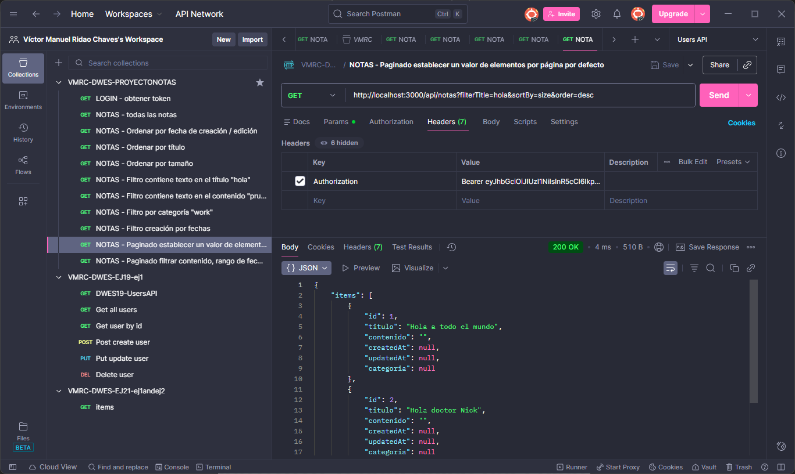

# Gestor de Notas (se añaden imágenes al final con los resultados)

Incluir en el proyecto de notas la posibilidad de ordenar, filtrar y paginar las notas.
Lo he hecho desde la interfaz de Postman.

## Implementación:

### Ordenación:
- Por fecha de creación/edición
- Por título
- Por tamaño
### Filtro:
- Contiene un texto en el titulo
- Contiene un texto en el contenido
- Igual a una categoría o grupo
- Pertenece a un rango de fechas según creación/actulización
### Paginado:
- Establecer un valor de elementos por página por defecto
- Mostrar el total de elementos

---

## Instalación

Se clona la carpeta con el trabajo desde el tema 20 y se añade a la carpeta del tema 21.

## Ejecución mediante capturas

### Se obtiene el TOKEN tras introducir el username y la contraseña correcta

---

### Se ven todas las notas

---

### Se ordenan las notas por fecha de creación/edición

---

### Se ordenan las notas por título

---

### Se ordenan las notas por tamaño

---

### Se filtran las notas por contener un texto en el título

---

### Se filtran las notas por contener un texto en el contenido

---

### Se filtran las notas por igualdad a una categoría o grupo

---

### Se filtran las notas por pertenecer a un rango de fecha según creación/actualización

---

### Se paginan las notas por establecer un valor de elementos por página por defecto

---

### Se paginan las notas por mostrar el total de elementos

---
