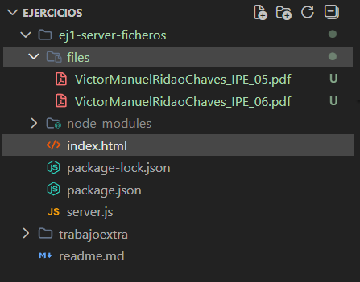
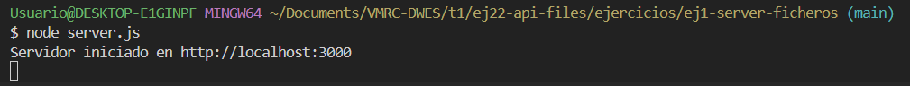
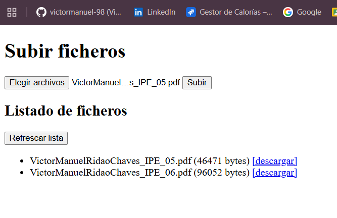

# Ejercicio 1: Montar un servidor de subida y decargar de ficheros almacenados en una carpeta 'files/'.

---

## Estructura del ejercicio (tree).

---

## Se levanta el servidor de ficheros

---

## Se muestran los ficheros subidos desde el navegador

---
