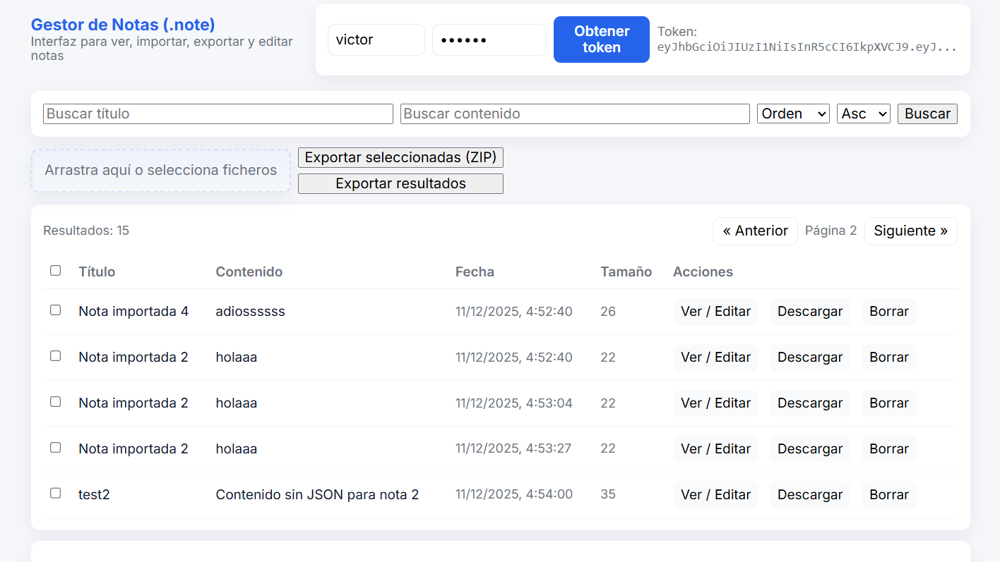
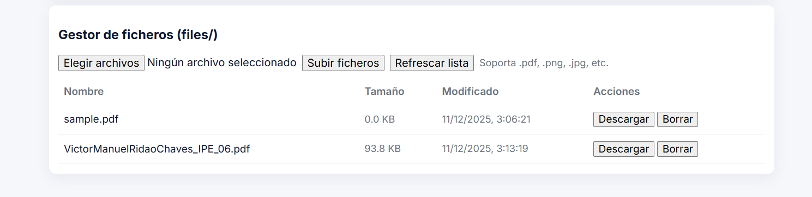

# Gestor de Notas (se añaden imágenes al final con los resultados)

Sobre el proyecto de notas:

- Permitir importar (subir) uno o varios ficheros de extensión .note para almacenarlo directamente.

- Permitir exportar las notas para descargar directamente los ficheros fuente, para mejor usabilidad, implementar filtros para la selección de notas.

---

## Instalación

Se clona la carpeta con el trabajo desde el tema 21 y se añade a la carpeta del tema 22.

## Ejecución mediante capturas

### Se levanta el servidor desde la terminal de vscode con bash.

---

### Se ven todas las notas con extensión '.note'

---

### Se ven los archivos con extensión '.pdf'

---
