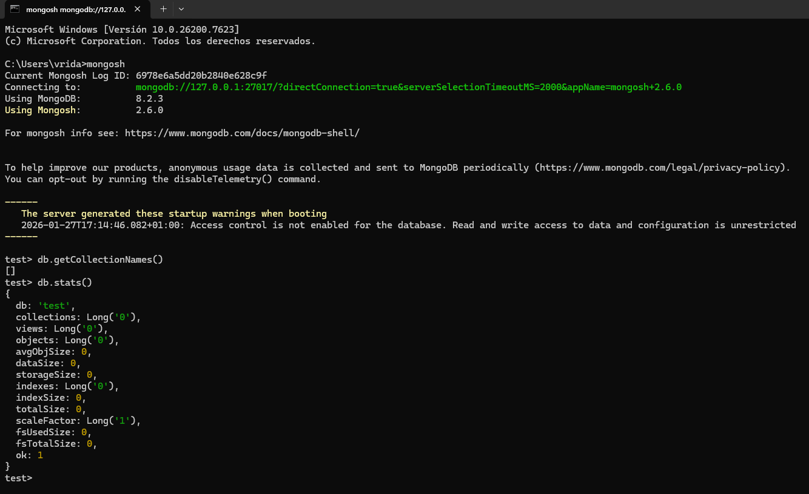
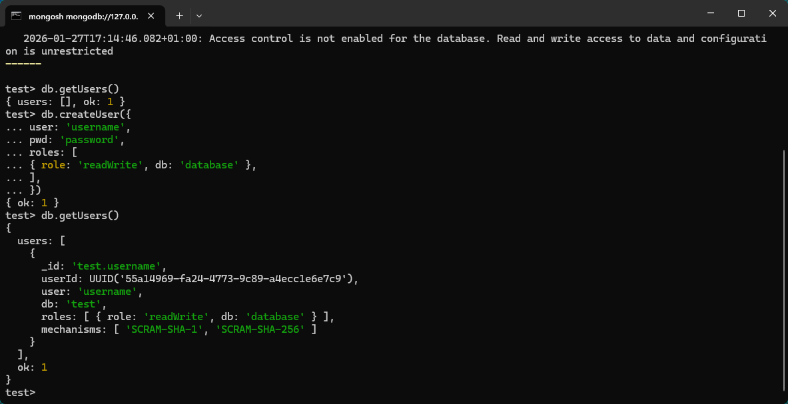

# Tema 33 DWES – Configuración MongoDB

## Objetivo
Comprobar que el servidor MongoDB está correctamente instalado y en funcionamiento mediante una conexión directa y la ejecución de una consulta básica.

---

## Entorno
- Sistema operativo: Windows 10
- MongoDB Server: 8.2.3
- MongoDB Shell (mongosh): 2.6.0
- Conexión: Local (`127.0.0.1:27017`)

## Imagenes de prueba
---
### 1. Conexión a Mongosh

---

### 2. Crear usuario

