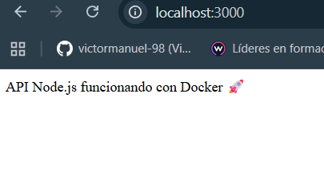

# Proyecto Docker Node.js

Este proyecto muestra cómo crear una **imagen Docker** para una API Node.js sencilla, usando **Docker Compose** y **variables de entorno**.  
El contenedor expone el puerto definido en `.env` y responde desde la ruta `/` con un mensaje de prueba.

## Estructura

- `Dockerfile` → define la imagen de Node.js  
- `docker-compose.yml` → automatiza el despliegue  
- `.env` → variables de entorno (puerto)  
- `.dockerignore` → archivos que no se incluyen en la imagen  
- `src/index.js` → código de la API

## Funcionamiento

1. Levantar contenedor:  
```
docker-compose --env-file .env up -d
````

2. Abrir navegador:

```
http://localhost:3000
```

3. Imagen de prueba del navegador:

