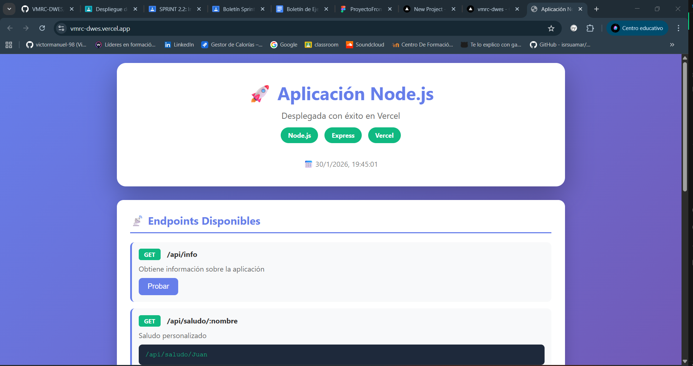

# Aplicación Node.js desplegada en Vercel

## Captura

<!-- Añadir captura de pantalla de la aplicación -->


---

## Aplicación Desplegada

**URL de la aplicación:** [https://tu-proyecto.vercel.app](https://tu-proyecto.vercel.app)

---

## Despliegue en Vercel

#### 1: Preparar el repositorio
Asegúrate de que tu código esté subido a GitHub:
```bash
git add .
git commit -m "Preparar proyecto para despliegue"
git push origin main
```

#### 2: Acceder a Vercel
1. Ve a [vercel.com](https://vercel.com)
2. Inicia sesión con tu cuenta de GitHub

#### 3: Importar el proyecto
1. Haz clic en **"Add New..."** → **"Project"**
2. Selecciona tu repositorio de GitHub (ejemplo: `VMRC-DWES`)
3. Haz clic en **"Import"**

#### 4: Configurar Root Directory ⚠️ IMPORTANTE
Esta es la parte clave si tu proyecto está en una subcarpeta:

1. Busca el campo **"Root Directory"**
2. Haz clic en **"Edit"**
3. Escribe la ruta de tu proyecto:
   ```
   t2/ej47-despliegue-app-server
   ```
4. Haz clic en **"Continue"**

#### 5: Configuración del Build
Vercel debería detectar automáticamente la configuración. Verifica que:

- **Framework Preset:** Other
- **Build Command:** (vacío o `npm install`)
- **Output Directory:** (vacío)
- **Install Command:** `npm install`

#### 6: Variables de Entorno (Opcional)
Si necesitas variables de entorno, añádelas en esta sección.

#### 7: Desplegar
1. Haz clic en **"Deploy"**
2. Espera 1-2 minutos mientras Vercel construye y despliega

#### 8: Verificar el despliegue
Una vez completado, verás:
- ✅ Estado del despliegue
- 🔗 URL de la aplicación (ejemplo: `https://vmrc-dwes.vercel.app/`)
- 📊 Logs del proceso

---

## Actualizaciones Automáticas

Una vez desplegado, Vercel está conectado a tu repositorio de GitHub:

1. Haces cambios en tu código local
2. Ejecutas `git push`
3. Vercel detecta los cambios automáticamente
4. Redespliegue automático en 1-2 minutos

---

## Estructura del Proyecto

```
ej47-despliegue-app-server/
│
├── index.js           # Servidor Express con todas las rutas
├── package.json       # Dependencias y scripts
├── vercel.json        # Configuración de Vercel
├── .gitignore         # Archivos a ignorar en Git
├── README.md          # Documentación (este archivo)
└── docs/              # Carpeta para documentación adicional
    └── screenshot.png # Captura de pantalla (añadir)
```