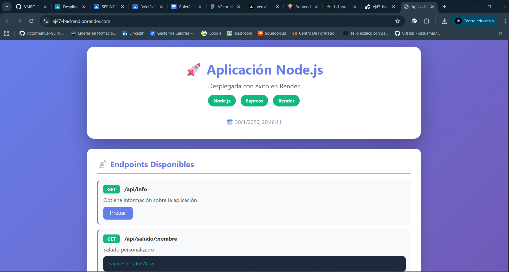

# Aplicación Node.js desplegada en Render

## Captura

<!-- Añadir captura de pantalla de la aplicación -->


---

## Aplicación Desplegada

**URL de la aplicación:** [https://tu-proyecto.onrender.com](https://tu-proyecto.onrender.com)

---

## Despliegue en Render

#### 1: Preparar el repositorio
Asegúrate de que tu código esté subido a GitHub:
```bash
git add .
git commit -m "Preparar proyecto para despliegue"
git push origin main
```

#### 2: Acceder a Render
1. Ve a [render.com](https://render.com)
2. Inicia sesión con tu cuenta de GitHub

#### 3: Crear un nuevo Web Service
1. Haz clic en **"+ New"** → **"Web Service"**
2. Conecta tu repositorio de GitHub (ejemplo: `VMRC-DWES`)
3. Haz clic en **"Connect"**

#### 4: Configurar el Proyecto ⚠️ IMPORTANTE
Esta es la parte clave si tu proyecto está en una subcarpeta:

1. **Name:** Dale un nombre a tu servicio (ej: `ej47-backend`)
2. **Runtime:** Selecciona **"Node"**
3. **Root Directory:** 
   ```
   t2/ej47-despliegue-app-server
   ```
4. **Build Command:**
   ```
   npm install
   ```
5. **Start Command:**
   ```
   node index.js
   ```

#### 5: Variables de Entorno (Opcional)
Si necesitas variables de entorno, añádelas en la sección **"Environment"**:
- PORT ya será asignado automáticamente por Render

#### 6: Plan de Hosting
1. Selecciona el plan **"Free"** (o el que prefieras)
2. Haz clic en **"Create Web Service"**

#### 7: Verificar el despliegue
Una vez completado, verás:
- ✅ Estado del despliegue
- 🔗 URL de la aplicación (ejemplo: `https://ej47-backend.onrender.com/`)
- 📊 Logs del proceso

---

## Actualizaciones Automáticas

Una vez desplegado, Render está conectado a tu repositorio de GitHub:

1. Haces cambios en tu código local
2. Ejecutas `git push`
3. Render detecta los cambios automáticamente
4. Redespliegue automático en 1-2 minutos

---

## Estructura del Proyecto

```
ej47-despliegue-app-server/
│
├── index.js           # Servidor Express con todas las rutas
├── package.json       # Dependencias y scripts
├── .gitignore         # Archivos a ignorar en Git
├── README.md          # Documentación (este archivo)
└── images/            # Carpeta para imágenes
    └── vercelapp.png  # Captura de pantalla (añadir)
```